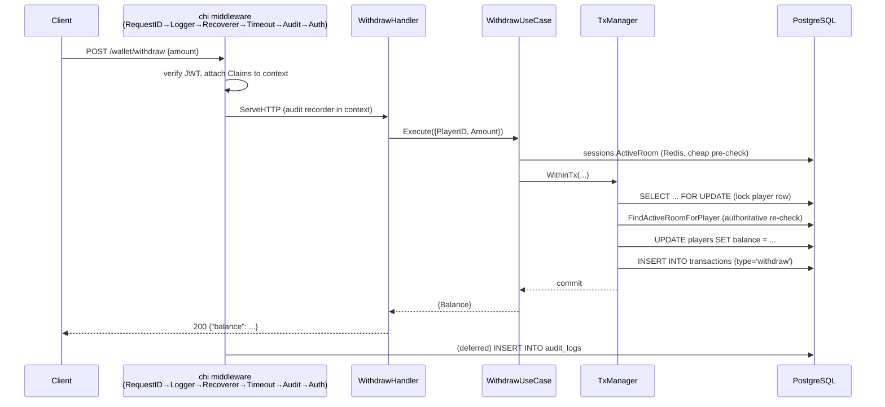
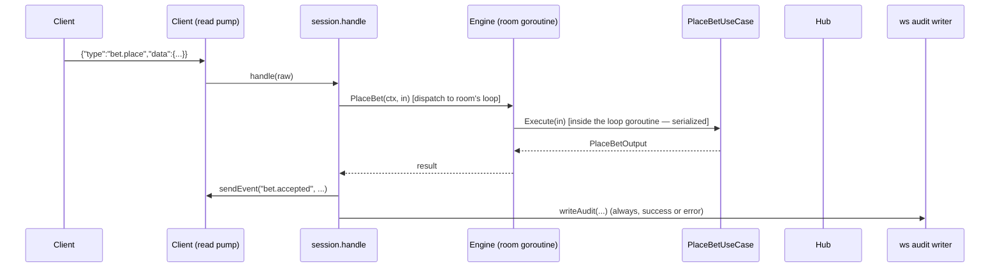

# Architecture

DDD + Clean Architecture, four layers, one dependency direction:

```
interfaces  →  application  →  domain
                    ↑
             infrastructure
```

- **domain** knows nothing outside the Go standard library. No SQL, no HTTP,
  no Redis, no JSON tags for the wire — just entities, value objects and
  business rules.
- **application** (use cases) depends on domain and on a set of narrow
  interfaces it declares itself (`internal/application/ports`). It does not
  know whether a `PlayerRepository` is backed by PostgreSQL or an in-memory
  fake.
- **infrastructure** *implements* those ports (pgx/sqlc, go-redis, bcrypt,
  JWT, `crypto/rand`) but is never imported by domain or application code —
  only by `internal/bootstrap` (the composition root).
- **interfaces** (REST handlers, the WebSocket hub) depend on application use
  cases (or narrow interfaces of them) and translate HTTP/WS wire formats
  to/from application input/output structs. They never touch domain types
  directly except to `errors.Is` against domain sentinel errors for HTTP
  status mapping.

This is enforced by convention (Go doesn't have a compiler-checked layering
rule), and checked informally by `go vet`/import review — a domain package
importing `net/http` or `pgx` would be an obvious code-review red flag.

## Package map

```
cmd/api/main.go                      process entry point: config, signals, listen, shutdown — thin
internal/
  bootstrap/                         composition root: wires every adapter + use case into an App
                                      (extracted from main.go so integration tests can reuse it)
  domain/
    player/                          Player aggregate, Wallet ops (Credit/Debit), Transaction, errors
    game/                            Room + Round + Bet aggregates, Choice/Outcome, DiceRoller port,
                                      Payout policy (1.92x), domain errors
    audit/                           immutable audit Entry
  application/
    auth/                            RegisterUseCase, LoginUseCase
    wallet/                          DepositUseCase, WithdrawUseCase, GetBalanceUseCase
    game/                            CreateRoom, JoinRoom, ListOpenRooms, StartRound, PlaceBet,
                                      SettleRound, CloseRoom, AbortRoom, RecoverRooms, RoomState,
                                      and Engine — the per-room timing goroutine on top of them
    ports/                           every interface application code depends on (repos, caches,
                                      TxManager, Clock, TokenService, PasswordHasher, IDGenerator)
  infrastructure/
    postgres/                        sqlc-generated queries (sqlcgen/) + repository implementations,
                                      TxManager, embedded-migration runner
    redis/                           RoomStateStore (open-room cache + join lock), PlayerSessionStore
                                      (active-room binding)
    auth/                            JWT issue/verify, bcrypt hasher, UUID generator
    dice/                            crypto/rand-backed DiceRoller
    clock/                           system Clock
    config/                          env var loading + validation
  interfaces/
    rest/                            chi router, middleware (JWT auth, audit, recover, timeout),
                                      handlers for auth/wallet/rooms/health
    ws/                              gorilla upgrader, Hub (connection registry + fan-out,
                                      implements application's Notifier port), per-connection
                                      session/event router, WS audit writer
db/
  migrations/                        golang-migrate SQL, embedded into the binary via db/embed.go
  queries/                           sqlc source SQL (db/queries/*.sql → sqlcgen)
api/openapi.yaml                     REST surface (OpenAPI 3.1)
docs/                                this file, WS_EVENTS.md, GAME_RULES.md, DECISIONS.md
bruno/                                Bruno collection: REST + WS requests
integration/                          black-box integration suite (build tag `integration`)
```

## Dependency rule in practice

- `internal/domain/game` has zero imports from this module. It compiles
  standalone.
- `internal/application/game` imports `internal/domain/game` and
  `internal/application/ports` — never `internal/infrastructure/*` or
  `internal/interfaces/*`.
- `internal/infrastructure/postgres` imports `internal/application/ports`
  (to implement its interfaces) and `internal/domain/game`/`player` (to
  rehydrate aggregates from rows) — never `internal/interfaces/*`.
- `internal/interfaces/ws` imports `internal/application/game` (concrete use
  case types, because the Engine's command surface is exactly those types)
  and `internal/application/ports`. It also imports `internal/interfaces/rest`
  for exactly one shared helper (`RedactPayload`), so both audit writers
  apply one redaction policy instead of two that could drift apart.
- Nothing under `internal/domain` or `internal/application` imports anything
  under `internal/infrastructure` or `internal/interfaces`. `go list -deps`
  on either package will not surface pgx, go-redis, chi or gorilla.

## Request flow

### REST: `POST /wallet/withdraw`



Every REST route mounted under the audited group writes exactly one
`audit_logs` row per request, success or failure, via a `defer` in
`AuditMiddleware` — so even a panic recovered by `Recoverer` still gets
audited (the panic becomes a 500, `Recoverer` runs *inside* the audit
middleware's scope).

### WebSocket: `bet.place`



The Engine is what makes bet ordering deterministic per room: `PlaceBet`,
`StartRound` and the settlement alarm for one room all funnel through the
same unbuffered command channel into one goroutine (`roomLoop.run`), so "bet
while settling" and "start a round while one is live" cannot even be
attempted concurrently *for that room*. A different room's loop runs fully
in parallel.

## Race-condition strategy

Several rules could be violated by concurrent requests; each has a specific,
layered defense — no single mechanism is trusted alone:

| Rule | Defenses (outer → inner) |
|---|---|
| One bet per round per player | `Round.PlaceBet` in-memory check → PostgreSQL `UNIQUE(round_id, player_id)` on `bets` |
| ≤6 players per room | Redis `AcquireJoinLock` (SETNX-style mutex, retried 4× with backoff) → `Room.Full()` on a row-locked room → PostgreSQL `PRIMARY KEY(room_id, player_id)` on `room_players` |
| One room per player | Redis `BindPlayerToRoom` (`SET NX`) checked before the transaction → `FindActiveRoomForPlayer` re-checked *inside* the transaction, after acquiring the room's row lock |
| Balance never goes negative | Every balance mutation (deposit/withdraw/bet/payout) runs inside one `TxManager.WithinTx` that starts with `SELECT ... FOR UPDATE` on the player row — nothing reads a balance for a decision without holding that lock first |
| A round settles exactly once | The round's `UPDATE ... SET status='settled'` is guarded on `WHERE status='betting'`, the aggregate itself refuses to re-settle (`ErrRoundAlreadySettled`), and only the room's own engine goroutine ever calls `SettleRound` for that room |
| Withdraw blocked while in a room | Redis `ActiveRoom` read *before* opening the transaction (cheap short-circuit) → `FindActiveRoomForPlayer` re-checked *inside* the transaction, closing the window between "join commits" and "withdrawal commits" |
| Round/bet timing decisions | Every deadline comparison uses `ports.Clock.Now()` (server clock) — a client-supplied timestamp is never read for a betting-window decision |

The per-room engine goroutine (above) is a *performance and coherence*
choice on top of these — it turns "six sockets racing six transactions"
into one ordered stream — but correctness does not *depend* on it: every
use case is safe to call directly and concurrently thanks to the DB-level
guards. That's deliberately true, because `PlaceBet` and `CloseRoom` *are*
called directly (bypassing the engine) when a room has no running loop yet
(`internal/application/game/engine.go`, the `errNoLoop` fallback paths).

## Redis vs PostgreSQL

PostgreSQL is the **source of truth** for everything: accounts, balances,
rooms, rounds, bets, the wallet ledger, and the audit trail. Nothing in this
system can lose data by losing Redis — every Redis-backed operation has a
fallback or a re-check against PostgreSQL, and Redis is populated with a
TTL, never authoritatively.

Redis holds two things, both *coordination/cache*, not state of record:

1. **Open-room cache** (`RoomStateStore`) — `GET /rooms` answers from a
   Redis hash of open-room summaries when it can (`source: "cache"` in the
   response), falling back to PostgreSQL on a miss and re-warming the cache.
   Also backs the short-lived per-room join mutex used for the 6-seat cap.
2. **Active-player binding** (`PlayerSessionStore`) — `active_player:{id} →
   room_id`, a `SET NX` claim used to fail a second `room.join`/`POST
   /rooms` fast, before it ever reaches PostgreSQL, and to answer "is this
   player in a room" cheaply for the withdrawal pre-check. Always re-verified
   against PostgreSQL before anything commits.

If Redis is unreachable, room listing falls back to PostgreSQL (slower, but
correct), and join/create/withdraw operations still work correctly because
every Redis-backed guard has a PostgreSQL-backed one behind it — Redis being
down degrades latency and cache-hit visibility, not correctness.

## Startup and shutdown

- **Startup** applies embedded migrations (`RUN_MIGRATIONS=true`, the
  default), opens the PostgreSQL pool and Redis client, and then runs a
  blunt recovery pass: every room not already `closed` is force-closed and
  every stake still `betting` (unsettled) in it is refunded. See
  `docs/DECISIONS.md` ADR 5 for why this policy is "close everything," not
  "resume what's resumable."
- **Shutdown** (SIGINT/SIGTERM) stops the HTTP server first (`Server.Shutdown`,
  no new connections, existing requests get `cfg.ShutdownTimeout` to finish),
  then calls `Engine.Shutdown(ctx)`, which stops every room's goroutine —
  aborting (refunding) any room with a live betting window, and leaving
  rooms that are idle between rounds exactly as they are for the next
  process's startup recovery to close.
