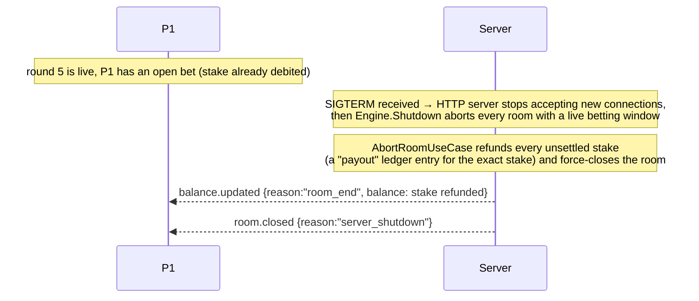

# WebSocket Protocol Reference

Endpoint: `GET /ws` (upgrades to a WebSocket connection).

This is the *complete* protocol as implemented in
[`internal/interfaces/ws/protocol.go`](../internal/interfaces/ws/protocol.go),
[`handler.go`](../internal/interfaces/ws/handler.go),
[`hub.go`](../internal/interfaces/ws/hub.go) and
[`errors.go`](../internal/interfaces/ws/errors.go) — treat those files as the
source of truth if this document and the code ever disagree.

Gameplay itself — starting a room/round and placing bets — happens **only**
over this socket. There is no REST equivalent for either.

## Envelope

Every frame, in both directions, is a single JSON object:

```json
{"type": "<event.name>", "data": { ... }}
```

- `type` is always present.
- `data` is omitted (or `null`) for events that carry no payload (`room.start`, `round.start`).

## Authentication

A socket must present a valid JWT — the same token `POST /auth/login`
issues — using exactly one of three mechanisms, checked in this order:

1. **`?token=<jwt>` query parameter** on the `GET /ws` handshake URL. This is
   the recommended path — it's what Bruno's native WS support and most
   WebSocket clients can set without custom header support.
2. **`Authorization: Bearer <jwt>` header** on the handshake request.
3. **A first `auth` frame**, for clients that can set neither of the above:
   ```json
   {"type": "auth", "data": {"token": "<jwt>"}}
   ```
   The server waits up to **10 seconds** for this frame after a handshake
   that carried no token; if it never arrives, is malformed, or carries an
   invalid token, the server sends `error{code:"unauthorized", event:"auth"}`
   and closes the connection.

If a token *is* present on the handshake (query param or header) but fails
verification, the server rejects the upgrade itself with a plain HTTP `401`
and the REST error envelope (`{"error":{"code":"unauthorized", ...}}`) —
the client never sees a socket in that case.

A repeated `auth` frame after the connection is already authenticated is
accepted as a no-op (not an error).

### One connection per player

Only one socket per player is allowed at a time. A newer login for the same
account **replaces** the older connection: the old socket receives
`error{code: "connection_replaced", event: ""}` and is then closed. There is
no way for one account to watch a table from two sockets simultaneously.

Disconnecting does **not** remove a player from a room — there is
deliberately no `room.leave` event in v1 (see `docs/DECISIONS.md`, ADR 9).
Players leave a room only when the room itself closes.

## Client → server events

| Event | Payload | Who | Notes |
|---|---|---|---|
| `auth` | `{"token": "<jwt>"}` | anyone | Only needed if the handshake carried no token. |
| `room.join` | `{"room_id": "<uuid>"}` | any authenticated player | Idempotent — joining a room you're already in succeeds silently. |
| `room.start` | *(none)* | room owner | Alias of `round.start` — starts the next round. Kept as a separate name because the spec phrases it as "starting a room or a round." |
| `round.start` | *(none)* | room owner | Opens the next betting window. |
| `bet.place` | `{"choice": "even"\|"odd", "amount": 1000}` | any seated player | `amount` is cents, like every monetary value in this API. One bet per player per round. |

### `room.join`

```json
{"type": "room.join", "data": {"room_id": "3fa85f64-5717-4562-b3fc-2c963f66afa6"}}
```

Seats the caller (they must already be a room *member* per `POST /rooms` or
a previous join — actually `room.join` is what performs the seating; a
player becomes a member the first time it succeeds). On success the server
pushes a fresh `room.state` to **every** player currently seated in the room,
including the joiner. Errors: `not_found`/`room_not_found`, `room_full`,
`room_closed`, `room_not_open`, `already_in_another_room`,
`join_in_progress`, `invalid_request` (missing `room_id`).

### `room.start` / `round.start`

```json
{"type": "round.start"}
```

Only the room owner may call this. On success the server does **not** reply
directly to the caller — instead it broadcasts `round.started` to every
member of the room (the caller included) once the betting window is
genuinely armed. Errors: `not_owner`, `room_not_open`/`room_closed`,
`round_in_progress`, `max_rounds_reached`, `no_players`,
`not_in_room` (caller has not joined any room on this socket).

### `bet.place`

```json
{"type": "bet.place", "data": {"choice": "even", "amount": 1000}}
```

`choice` is case-insensitive on input (`"EVEN"` normalizes to `"even"`) but
the accepted-bet payload always echoes the lowercase canonical form. Errors:
`not_in_room`, `invalid_request` (bad choice, non-positive amount),
`no_active_round`, `betting_closed`, `duplicate_bet`, `insufficient_balance`,
`round_settled`.

## Server → client events

| Event | Pushed to | Notes |
|---|---|---|
| `room.state` | the joiner (+ everyone already seated, on `room.join`) | Full snapshot. |
| `round.started` | every room member | Announces a new betting window. |
| `bet.accepted` | the bettor only | Acknowledges *their own* bet — never a balance. |
| `round.result` | every room member | Dice, outcome, winners. |
| `balance.updated` | each member individually | Pushed once per player, after `round.result` (or after `room.closed`). |
| `room.closed` | every room member | Terminal. |
| `error` | the command's sender | Rejects one inbound command. |

### `room.state`

```json
{
  "type": "room.state",
  "data": {
    "room_id": "3fa85f64-5717-4562-b3fc-2c963f66afa6",
    "owner_id": "6f9619ff-8b86-d011-b42d-00c04fc964ff",
    "status": "open",
    "current_round": 1,
    "max_rounds": 10,
    "player_count": 2,
    "max_players": 6,
    "players": ["6f9619ff-8b86-d011-b42d-00c04fc964ff", "b3fc2c96-3f66-afa6-5717-4562fa85f64"],
    "round": {
      "round_id": "9a1e1f7a-...",
      "round_number": 1,
      "status": "betting",
      "opens_at": "2026-08-19T12:00:00Z",
      "closes_at": "2026-08-19T12:00:15Z",
      "die1": 0,
      "die2": 0,
      "outcome": ""
    }
  }
}
```

`round` is `null`/omitted when no round has started yet. Once a round is
settled, `die1`/`die2`/`outcome` are populated and `status` is `"settled"`.
`status` (room-level) is one of `"open"`, `"closing"`, `"closed"`.

This event is read straight from PostgreSQL (never the cache) precisely
*because* a client uses it to decide whether it can still bet.

### `round.started`

```json
{
  "type": "round.started",
  "data": {
    "room_id": "3fa85f64-5717-4562-b3fc-2c963f66afa6",
    "round_id": "9a1e1f7a-...",
    "round_number": 1,
    "opens_at": "2026-08-19T12:00:00Z",
    "closes_at": "2026-08-19T12:00:15Z"
  }
}
```

`closes_at` is the backend's authoritative deadline (`opens_at` + the
configured `BETTING_WINDOW`, 15s by default). Clients must not compute their
own countdown from anything other than this field — the backend clock always
wins.

### `bet.accepted`

```json
{
  "type": "bet.accepted",
  "data": {
    "bet_id": "c1a2b3d4-...",
    "room_id": "3fa85f64-5717-4562-b3fc-2c963f66afa6",
    "round_id": "9a1e1f7a-...",
    "round_number": 1,
    "choice": "even",
    "amount": 1000
  }
}
```

Sent only to the player who placed the bet. **Deliberately carries no
balance** — the spec requires `bet.place` to return only the bet result. The
stake was already debited by the time this arrives; the player's new balance
is not pushed until the round ends (`balance.updated`).

### `round.result`

```json
{
  "type": "round.result",
  "data": {
    "room_id": "3fa85f64-5717-4562-b3fc-2c963f66afa6",
    "round_id": "9a1e1f7a-...",
    "round_number": 1,
    "die1": 3,
    "die2": 4,
    "sum": 7,
    "outcome": "odd",
    "winners": [
      {
        "player_id": "6f9619ff-8b86-d011-b42d-00c04fc964ff",
        "bet_id": "c1a2b3d4-...",
        "choice": "odd",
        "amount": 1000,
        "payout": 1920
      }
    ],
    "room_closed": false
  }
}
```

`winners` lists only *winning* bets (losers are silent — a player who lost
learns it by absence from this list, and by their unchanged balance in the
`balance.updated` that follows). `payout` is the **gross** amount credited
(includes the stake back): `payout = amount * 192 / 100` — see
`docs/GAME_RULES.md`. `room_closed` is `true` when this was the room's 10th
round, or the owner's earlier `DELETE /rooms/{id}` had this round as the
last one to finish.

### `balance.updated`

```json
{
  "type": "balance.updated",
  "data": {
    "player_id": "6f9619ff-8b86-d011-b42d-00c04fc964ff",
    "room_id": "3fa85f64-5717-4562-b3fc-2c963f66afa6",
    "balance": 6920,
    "reason": "round_end"
  }
}
```

`reason` is `"round_end"` (pushed right after `round.result`) or
`"room_end"` (pushed right after `room.closed` — either the same event as a
10th-round settlement, where `round_end`'s balance already reflects the
closure and no second push happens, or a `DELETE /rooms/{id}` close with no
live round, where this is the only balance push). This is sent **once per
player**, individually — not broadcast — and is the *only* moment a balance
crosses the wire during play; `bet.accepted` never carries one, matching the
REST wallet endpoints which are a separate, pull-based channel.

### `room.closed`

```json
{"type": "room.closed", "data": {"room_id": "3fa85f64-5717-4562-b3fc-2c963f66afa6", "reason": "owner_closed"}}
```

`reason` is one of:

| reason | meaning |
|---|---|
| `owner_closed` | the owner's `DELETE /rooms/{id}` took effect (immediately, or once the live round settled) |
| `max_rounds_reached` | the 10th round just settled |
| `server_shutdown` | the process is shutting down with a live betting window; open stakes were refunded |
| `recovered_after_restart` | a previous process died mid-table; startup recovery refunded open stakes |
| `settlement_failed` | dice/database failure during settlement; open stakes were refunded |

Sent to every member, and always preceded by each member's final
`balance.updated{reason:"room_end"}`. The hub also drops its internal
room→members index right after (`DetachRoom`), so no further events for that
room id are possible.

### `error`

```json
{"type": "error", "data": {"code": "duplicate_bet", "message": "you already placed a bet in this round", "event": "bet.place"}}
```

`event` echoes the client event that failed, so a client without a
request-id can still correlate the rejection. It is empty for
connection-level errors that were not triggered by a specific command (e.g.
`connection_replaced`).

## Error code table

Codes mirror the REST envelope's vocabulary where the same failure can occur
on both channels.

| code | meaning |
|---|---|
| `unauthorized` | handshake/first-frame authentication failed |
| `unknown_event` | `type` is not one of the client→server events above |
| `invalid_request` | malformed frame, bad `choice`, non-positive `amount`, missing/blank id |
| `connection_replaced` | a newer login for the same account took over the socket |
| `not_in_room` | the command needs a joined room and the caller has none on this socket |
| `join_in_progress` | another `room.join` for this room is in flight — retry |
| `server_shutting_down` | the process is shutting down |
| `room_not_found` | no room with this id |
| `not_found` | round/bet not found |
| `room_full` | the room's 6 seats are all taken |
| `room_closed` | the room is already closed |
| `room_not_open` | the room is closing, not open, for joins/rounds |
| `already_in_another_room` | caller is seated in a different room |
| `not_a_member` | caller is not seated in this room |
| `not_owner` | only the room owner may do that |
| `round_in_progress` | a round is already live |
| `no_active_round` | no round is currently accepting bets |
| `round_settled` | the round already has a result |
| `max_rounds_reached` | the room already played all 10 rounds |
| `no_players` | the room has no seated players |
| `betting_closed` | the 15s betting window has closed (or not opened yet) |
| `duplicate_bet` | caller already bet in this round |
| `insufficient_balance` | balance cannot cover the bet |
| `internal_error` | unexpected server error |

## Sequence walkthrough: a complete round

Two players, `P1` (owner) and `P2`, already registered/logged in and holding
a balance.

```mermaid
sequenceDiagram
    participant P1 as P1 (owner)
    participant P2
    participant S as Server

    Note over P1: POST /rooms (REST) → room created, P1 seated
    P1->>S: room.join {room_id}
    S-->>P1: room.state (player_count: 1)
    P2->>S: room.join {room_id}
    S-->>P1: room.state (player_count: 2)
    S-->>P2: room.state (player_count: 2)

    P1->>S: round.start {}
    S-->>P1: round.started {round_number:1, closes_at}
    S-->>P2: round.started {round_number:1, closes_at}

    P1->>S: bet.place {choice:"even", amount:1000}
    S-->>P1: bet.accepted {bet_id, amount:1000}
    P2->>S: bet.place {choice:"odd", amount:500}
    S-->>P2: bet.accepted {bet_id, amount:500}

    Note over S: betting window closes at closes_at;<br/>the room's goroutine settles automatically
    S-->>P1: round.result {die1,die2,sum,outcome,winners:[P2]}
    S-->>P2: round.result {die1,die2,sum,outcome,winners:[P2]}
    S-->>P1: balance.updated {reason:"round_end", balance: 4000-1000}
    S-->>P2: balance.updated {reason:"round_end", balance: previous+960*2-...}
```

Notes on that flow:

- Nobody sends anything to make the round *end* — the server's per-room
  goroutine wakes up on the `closes_at` deadline and settles automatically.
- `bet.accepted` never carries a balance; both players only learn their new
  balance from `balance.updated`, after `round.result`.
- Steps repeat (owner sends `round.start` again) up to round 10, at which
  point settlement also emits `room.closed{reason:"max_rounds_reached"}`
  right after the final `balance.updated`.

## Sequence walkthrough: graceful close mid-round

```mermaid
sequenceDiagram
    participant P1 as P1 (owner)
    participant P2
    participant S as Server

    Note over P1: round 3 is live, betting window open
    Note over P1: DELETE /rooms/{id} (REST)
    Note over S: room.status → "closing"; response: {closed:false, status:"closing"}
    Note over S: round 3's betting window still runs to closes_at
    P2->>S: bet.place {choice:"odd", amount:500}
    S-->>P2: bet.accepted {...}

    Note over S: closes_at reached → settlement runs,<br/>and because status was "closing" the room<br/>also transitions to "closed" in the same transaction
    S-->>P1: round.result {..., room_closed: true}
    S-->>P2: round.result {..., room_closed: true}
    S-->>P1: balance.updated {reason:"room_end"}
    S-->>P2: balance.updated {reason:"room_end"}
    S-->>P1: room.closed {reason:"owner_closed"}
    S-->>P2: room.closed {reason:"owner_closed"}
```

The room never closes mid-round — "a room is only closed when the current
round ends" holds even for an owner-initiated close.

## Sequence walkthrough: server shutdown mid-round



No dice are rolled for an aborted round — see `docs/DECISIONS.md` ADR 4 and
ADR 5 for why refunding (not settling early) is the chosen behavior, and for
what happens on the *next* process's startup if a room was left behind
entirely (recovery, ADR 5).
